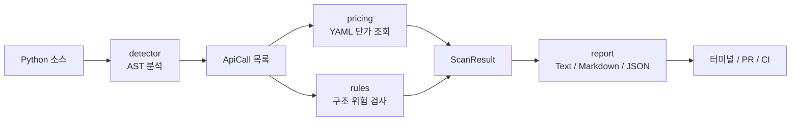

# APrIce

[](https://github.com/ohssorry/APrIce/actions/workflows/ci.yml)
[](pyproject.toml)
[](LICENSE)

> 코드를 읽고, 머지 전에 API 비용 위험을 알려주는 오픈소스 정적 분석기

APrIce는 Python 소스코드를 **AST(Abstract Syntax Tree)**로 분석해 유료 API 호출을
찾습니다. 각 호출의 **요청당 비용 범위**, 루프처럼 비용을 키울 수 있는
**구조적 위험**, 그리고 PR이 만드는 **비용·위험 변화**를 보여줍니다.

운영 후 청구서를 설명하는 도구가 아니라, 개발자가 **실행하기 전·머지하기 전**
코드 리뷰에서 판단할 수 있게 돕는 도구입니다.

## 30초 만에 확인하기

APrIce는 아직 PyPI에 배포되지 않았습니다. 저장소에서 설치해 바로 실행할 수 있습니다.

```console
git clone https://github.com/ohssorry/APrIce.git
cd APrIce
pip install -e ".[dev]"
aprice scan tests/fixtures/sample_app.py
```

실행하면 호출 위치, 모델, 요청당 비용 범위와 위험을 함께 보여줍니다.

```text
APrIce: 5 API call(s) found

Cost per request
  tests/fixtures/sample_app.py:27  claude-opus-5   $0.03572 - $0.10740
  tests/fixtures/sample_app.py:40  gpt-4o          $0.00327 - $0.00506
  ...

Unpriced
  tests/fixtures/sample_app.py:49  anthropic/<dynamic>

Findings
  ! tests/fixtures/sample_app.py:27  [call-in-loop]
    API call inside a loop: cost scales with the number of iterations,
    which this tool cannot see.
```

이 결과에서 바로 알 수 있는 것은 세 가지입니다.

| 결과 | 의미 |
|---|---|
| `$0.03572 - $0.10740` | 해당 호출 1회의 비용을 단일값이 아닌 범위로 표시 |
| `call-in-loop` | 호출이 루프 안에 있어 반복 횟수만큼 비용이 커질 수 있음 |
| `<dynamic>` / `Unpriced` | 모델명이 변수이거나 가격 DB에 없어 계산할 수 없음을 숨기지 않음 |

## 왜 APrIce가 필요한가요?

대부분의 비용 도구는 이미 사용한 금액을 대시보드나 로그에서 집계합니다. 하지만
비용 문제를 가장 싸게 고칠 수 있는 시점은 청구서가 나온 뒤가 아니라 **코드를
리뷰하는 순간**입니다.

실제 프로젝트의 API 호출은 별도 프롬프트 파일보다 소스 안에 있는 경우가 많습니다.

```python
for user in users:
    client.messages.create(
        model="claude-opus-5",
        max_tokens=4096,
        messages=[{"role": "user", "content": f"Summarize: {user.doc}"}],
    )
```

문자열 검색은 `messages.create`를 찾을 수는 있어도 이것이 주석인지, 실제 호출인지,
루프 안인지 구분하기 어렵습니다. APrIce는 소스의 문법 구조를 읽기 때문에 다음을
함께 파악합니다.

- 실제 API 호출인지 여부
- 모델명과 `max_tokens` 같은 인자
- 파일과 줄 번호
- 루프 깊이와 정적으로 확인 가능한 반복 상한

### 다른 접근과의 차이

| 구분 | 사용량 대시보드 | 프롬프트 파일 분석 | APrIce |
|---|---|---|---|
| 확인 시점 | 실행 후 | 작성 중 | **실행·머지 전** |
| 분석 대상 | 청구·사용 로그 | 분리된 프롬프트 파일 | **실제 Python 소스코드** |
| 루프 문맥 | 확인 어려움 | 확인 불가 | **AST로 탐지** |
| PR 변화 비교 | 별도 연동 필요 | 도구별 상이 | **비용 범위와 구조 위험 비교** |
| 호출량 없는 월 비용 예측 | 로그가 있으면 가능 | 가정 필요 | **의도적으로 하지 않음** |

## 가장 중요한 원칙: 알 수 없는 숫자는 만들지 않습니다

정적 분석만으로는 코드 한 줄이 실제로 몇 번 실행되는지 알 수 없습니다.

```python
for user in users:  # users가 10명인지 1,000만 명인지 소스만으로는 알 수 없음
    client.messages.create(...)
```

그래서 APrIce는 임의의 트래픽을 곱해 월 청구액을 예측하지 않습니다. 대신 소스와
가격 DB에서 근거를 추적할 수 있는 정보만 제공합니다.

- **요청당 비용 범위**: 모델 단가, 공개된 입력 토큰 가정, `max_tokens`로 계산
- **구조적 위험**: 루프, 중첩 루프, 출력 상한 누락 등을 경고
- **PR 변화량**: 기준 브랜치와 현재 브랜치 사이의 비용 범위·위험 변화
- **미가격 호출**: 추측하지 않고 `Unpriced`로 명시

입력 길이는 런타임 데이터에 따라 달라질 수 있으므로 `--input-tokens`로 사용자가
직접 정합니다. 기본값은 1,000이며 실행 명령에 그대로 드러납니다. 자세한 계산식과
가정은 [비용 산정 방법론](docs/methodology.md)에 설명되어 있습니다.

## 핵심 기능

### 1. AST 기반 API 호출 탐지

정규식 대신 Python 표준 라이브러리 `ast`를 사용합니다. 주석과 문자열의 가짜
일치를 제외하고, 실제 호출의 인자와 루프 문맥을 구조적으로 읽습니다.

### 2. 요청당 비용을 범위로 계산

`src/aprice/prices/*.yaml`에 기록된 입력·출력 단가를 사용합니다. 출력 토큰은
`max_tokens`가 모두 사용되는 경우를 상한으로 두며, 불확실성을 대표값 하나로
감추지 않습니다.

### 3. 비용을 키우는 코드 구조 경고

- 루프 안 API 호출
- 여러 겹의 중첩 루프 안 호출
- 정적으로 확인되는 반복 상한의 증가
- `max_tokens` 누락 또는 지나치게 큰 출력 상한
- 변수로 전달되어 가격을 결정할 수 없는 모델명
- 변경된 Python 파일의 파싱 실패

### 4. PR 전후 비용·위험 비교

`aprice diff`는 기준 ref와 현재 ref를 각각 임시 Git worktree에서 스캔합니다. 실제
작업 트리와 staged/unstaged 변경은 건드리지 않습니다.

```console
aprice diff --base origin/develop --head HEAD
aprice diff --base origin/develop --head HEAD --format markdown
aprice diff --base origin/develop --head HEAD --fail-on-risk
```

`--fail-on-risk`는 비용이 올랐다는 이유만으로 실패하지 않습니다. 새 루프 호출,
루프 깊이 증가, 알려진 반복 상한의 악화, 변경 파일 파싱 실패처럼 **코드 구조가
새롭게 나빠진 경우**에만 CI 종료 코드 `1`을 반환합니다.

### 5. APrIce Guard

이 저장소의 `develop` 대상 PR에서는
[APrIce Guard](.github/workflows/guard.yml)가 자동으로 실행됩니다.

- 기준 브랜치와 PR의 요청당 비용 변화를 Markdown으로 요약
- 새 구조적 위험과 미가격 호출 표시
- 같은 PR에 다시 push하면 기존 코멘트를 갱신
- fork PR처럼 코멘트 권한이 없으면 GitHub Actions job summary에 기록
- 비용·모델 변경만으로는 차단하지 않고 새 구조적 위험만 차단

### 6. 기여하기 쉬운 YAML 가격 데이터베이스

가격표는 탐지 코드와 분리되어 있습니다. 공식 가격이 바뀌어도 Python 로직을 고칠
필요 없이 YAML 한 항목을 수정하고 출처와 확인일을 남기면 됩니다.

```yaml
provider: anthropic
models:
  - id: claude-sonnet-5
    input_per_mtok: 3.00
    output_per_mtok: 15.00
    verified_on: 2026-08-17
```

## 동작 구조

APrIce는 각 모듈이 한 가지 책임만 갖는 단방향 파이프라인입니다.



탐지기는 가격을 모르고, 가격 모듈은 AST를 모릅니다. 공용 데이터 모델을 통해서만
연결되므로 새 공급자, 위험 규칙, 출력 형식을 서로 독립적으로 확장할 수 있습니다.

| 모듈 | 역할 |
|---|---|
| `detector.py` | AST에서 API 호출·인자·루프 문맥 추출 |
| `pricing.py` | YAML 가격 조회와 요청당 low-high 계산 |
| `rules.py` | 가격과 무관한 구조적 비용 위험 검사 |
| `diff.py` | 두 Git ref의 호출·비용·위험 변화 비교 |
| `report.py` | Text, Markdown, JSON 결과 생성 |
| `cli.py` | 명령행 인자, 실행 순서와 종료 코드 관리 |

더 자세한 설계 의도와 모듈 계약은 [아키텍처 문서](docs/architecture.md)를 참고하세요.

## 실행 전 정적 분석과 실행 후 관측의 연결

루트 패키지 `aprice`는 **실행 전에 소스코드**를 분석합니다. 별도 확장 패키지
[`aprice-advisor`](advisor/README.md)는 **실행 후 JSONL 사용 로그**를 읽어 정적
분석만으로 알 수 없는 낭비를 찾습니다.

| 구분 | APrIce | APrIce Advisor |
|---|---|---|
| 시점 | 실행·머지 전 | 실행 후 |
| 입력 | Python 소스코드 | 실제 API 사용 로그 |
| 확인 내용 | 호출 위치, 비용 범위, 루프·상한 위험 | 캐시 미사용, 중복 호출, 재시도 비용 |
| 공통 원칙 | 소스와 가격 DB에 근거 | 관측 로그와 가격 DB에 근거 |

두 계층 모두 임의의 호출량을 만들지 않습니다. 정적 분석이 모르는 실제 동작은
추측하는 대신 관측 데이터가 있을 때만 Advisor가 다룹니다.

## 지원 범위

| 공급자 | 탐지하는 호출 | 가격 확인일 |
|---|---|---:|
| Anthropic | `.messages.create()`, `.messages.stream()`, `.messages.batches.create()` | 2026-08-17 |
| OpenAI | Chat Completions, Responses, Completions, Embeddings, Images, Audio API | 2026-08-19 |
| Google | `.generate_content()`, `.models.generate_content()`, `.models.embed_content()` | 2026-08-19 |

가격은 바뀔 수 있으므로 README의 날짜보다 각
[가격 YAML](src/aprice/prices/)의 `verified_on`을 기준으로 확인해 주세요.

## 사용법

### 파일 또는 디렉터리 스캔

```console
aprice scan app.py
aprice scan src/
```

### 출력 형식 선택

```console
aprice scan src/ --format text
aprice scan src/ --format markdown
aprice scan src/ --format json
```

### 입력 토큰 가정 변경

```console
aprice scan src/ --input-tokens 4000
```

### CI에서 기존 위험까지 엄격하게 검사

```console
aprice scan src/ --fail-on-warning
```

`scan --fail-on-warning`은 현재 스캔에서 발견된 모든 경고를 대상으로 합니다.
기존 위험은 허용하고 PR이 새로 만드는 위험만 차단하려면
`diff --fail-on-risk`를 사용하세요.

## 프로젝트 구조

```text
APrIce/
├── src/aprice/             # 정적 분석기와 CLI
│   ├── prices/*.yaml       # 공급자별 가격 DB
│   ├── detector.py         # AST 호출 탐지
│   ├── pricing.py          # 비용 범위 계산
│   ├── rules.py            # 구조 위험 규칙
│   ├── diff.py             # Git ref 비교
│   └── report.py           # Text / Markdown / JSON 출력
├── advisor/                # 실행 로그 기반 확장 패키지
├── tests/                  # 단위·통합·CLI 회귀 테스트
├── docs/                   # 방법론, 아키텍처, 온보딩 문서
└── .github/                # CI, Guard, Issue·PR 템플릿
```

핵심 기능에는 단위·통합·CLI 회귀 테스트가 있으며, CI가 테스트와 Ruff 린트·포맷을
검사합니다.

```console
pytest
ruff check .
ruff format --check .
```

## 알려진 한계

- 현재 정적 탐지는 Python 소스코드만 지원합니다.
- `model=config.MODEL`처럼 동적으로 정해지는 모델은 호출 위치는 찾지만 가격은
  추측하지 않습니다.
- 파일 간 데이터 흐름을 역추적하지 않습니다.
- 런타임 입력 토큰과 실제 호출 횟수는 소스만으로 알 수 없습니다.
- 가격은 변할 수 있으므로 `verified_on` 이후 변경 여부를 확인해야 합니다.
- 아직 PyPI에 배포되지 않아 소스에서 설치해야 합니다.

이 한계들은 누락이 아니라 오탐과 근거 없는 숫자를 줄이기 위한 현재의 설계
경계입니다. 지원 범위를 넓힐 때도 가정이 사용자에게 보이고 수정 가능해야 한다는
원칙을 유지합니다.

## 기여하기

APrIce는 가격과 SDK가 계속 변한다는 전제에서 설계되었습니다. Python 코드를 몰라도
공식 가격을 확인해 YAML을 갱신하는 것부터 기여할 수 있습니다.

기여 예시:

- 새 모델 가격과 공식 출처 추가
- 새 공급자 또는 SDK 호출 시그니처 추가
- 새로운 구조적 비용 위험 규칙 제안
- 실제 프로젝트의 탐지 누락·오탐 재현 사례 제공
- 문서, 예제, Windows/macOS/Linux 호환성 개선

모든 변경은 Issue에서 문제와 근거를 공유한 뒤 브랜치와 PR을 만들고, 다른 팀원의
리뷰를 거쳐 `develop`에 머지합니다. 자세한 절차는
[CONTRIBUTING.md](CONTRIBUTING.md)를 확인하세요.

## 문서 안내

| 문서 | 처음 읽을 때 궁금한 점 |
|---|---|
| [온보딩](docs/onboarding.md) | 프로젝트를 빠르게 이해하고 개발 환경을 구성하려면? |
| [비용 산정 방법론](docs/methodology.md) | 범위는 어떻게 계산하고 무엇을 추정하지 않나? |
| [아키텍처](docs/architecture.md) | 모듈은 어떻게 나뉘고 데이터는 어떻게 흐르나? |
| [기여 가이드](CONTRIBUTING.md) | Issue, 브랜치, 테스트, PR은 어떻게 진행하나? |

## 라이선스

APrIce와 APrIce Advisor는 [MIT License](LICENSE)로 공개됩니다.
