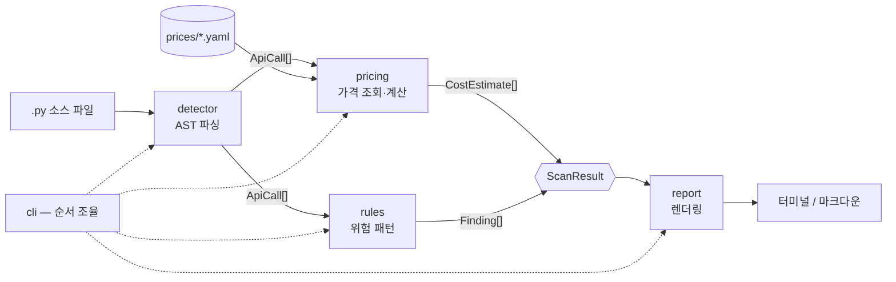

# 아키텍처

APrIce가 어떻게 생겼고, 각 모듈이 서로 무엇을 약속하는지 정리한 문서입니다.
**3명이 병렬로 작업할 때 서로의 코드를 깨뜨리지 않기 위한 계약서**이기도 합니다.

---

## 1. 전체 그림

APrIce는 파이프라인입니다. 데이터가 한 방향으로만 흐르고, 되돌아오지 않습니다.



핵심은 **`detector`가 가격을 모르고, `pricing`이 AST를 모른다**는 점입니다.
둘 사이의 유일한 접점은 `models.py`의 `ApiCall` 하나입니다. 그래서 A와 B가
같은 시간에 각자 작업해도 충돌하지 않습니다.

---

## 2. 왜 이렇게 나눴나

| 결정 | 이유 |
|---|---|
| 정규식이 아니라 **AST** | 주석·문자열 속 가짜 매치를 거르고, **호출이 루프 안인지** 알아야 하며, `max_tokens=4096` 같은 인자 값을 읽어야 함. 셋 다 정규식으로는 불가능 |
| 가격을 **코드가 아닌 YAML**로 | 가격 갱신이 문서 수정 크기의 PR이 됨. 외부 기여자가 파이썬을 몰라도 기여 가능 → 오픈소스 발전 가능성의 핵심 서사 |
| `rules`를 `pricing`과 **분리** | 루프 안 호출은 모델이 뭐든 위험. 가격을 몰라도(=YAML에 없어도) 경고는 나가야 함 |
| `report`를 **맨 끝에 격리** | 출력 형식(터미널/마크다운/향후 SARIF·JSON)이 늘어나도 계산 로직은 안 건드림 |
| 단일 값이 아니라 **범위** | 출력 길이는 `max_tokens`가 상한일 뿐 실제로는 그보다 적음. 단정하면 거짓말이 됨 → [`methodology.md`](methodology.md) |

---

## 3. 모듈별 계약

각 모듈의 **공개 함수 시그니처**입니다. 이 시그니처를 바꾸는 건 다른 사람의
코드를 깨뜨리는 변경이므로, **이슈를 먼저 열어야 합니다.**

### `models.py` — 공용 데이터 구조 🔒

전 모듈이 의존합니다. **혼자 수정 금지. 3명 합의 필요.**

| 타입 | 역할 | 주요 필드 |
|---|---|---|
| `ApiCall` | 발견된 호출 1건 | `provider`, `file`, `line`, `model?`, `max_tokens?`, `loop_depth` |
| `Price` | 모델 1개의 단가 | `provider`, `model`, `input_per_mtok`, `output_per_mtok` |
| `CostEstimate` | 호출 1건의 비용 범위 | `call`, `price`, `low_usd`, `high_usd` |
| `Finding` | 구조적 위험 1건 | `call`, `rule`, `severity`, `message` |
| `ScanResult` | 스캔 1회의 전체 결과 | `calls`, `estimates`, `findings`, `unpriced` |

`ApiCall`·`Price`·`CostEstimate`·`Finding`은 **frozen dataclass**입니다.
만든 뒤 수정하지 않습니다 — 파이프라인 중간에서 값이 바뀌면 추적이 불가능해집니다.

`model`이 `None`인 경우가 있습니다. 모델명이 변수로 넘어와 소스에 리터럴로
없을 때입니다. **이때 호출을 버리지 않습니다.** "찾았지만 가격을 모름"으로
`ScanResult.unpriced`에 남깁니다.

### `detector.py` — 담당 A

```python
scan_source(source: str, filename: str) -> list[ApiCall]
scan_path(root: Path) -> list[ApiCall]
CALL_SIGNATURES: dict[tuple[str, ...], str]   # 점 경로 꼬리 -> provider
```

- SDK를 **점 경로의 꼬리**로 매칭합니다. `client.messages.create`든
  `self.oai.chat.completions.create`든 클라이언트 변수명과 무관하게 잡힙니다
- 파싱 실패한 파일은 **건너뜁니다.** 저장소 전체 스캔이 깨진 파일 하나로 죽으면 안 됨
- 새 프로바이더 추가 = `CALL_SIGNATURES`에 한 줄 추가

### `pricing.py` — 담당 B

```python
load_prices() -> dict[tuple[str, str], Price]        # lru_cache
lookup(provider: str, model: str | None) -> Price | None
estimate(call: ApiCall, input_tokens: int = 1000) -> CostEstimate | None
```

- 모르는 모델이면 **`None`을 반환합니다.** 추측하지 않습니다
- 상한 = `max_tokens` 전부 사용, 하한 = 그 30%(`TYPICAL_OUTPUT_RATIO`)
- YAML 스키마:

```yaml
provider: anthropic
models:
  - id: claude-sonnet-5
    input_per_mtok: 3.00
    output_per_mtok: 15.00
    verified_on: 2026-08-17    # 오래된 가격이 눈에 보이도록
```

### `rules.py` — 담당 A

```python
check(call: ApiCall) -> list[Finding]
check_all(calls: list[ApiCall]) -> list[Finding]
```

가격을 전혀 참조하지 않습니다. 현재 규칙: `call-in-loop`,
`call-in-nested-loop`, `no-max-tokens`, `large-max-tokens`, `model-not-literal`.

`severity`는 `"warn"` 또는 `"info"`입니다. `--fail-on-warning`이 CI를 막는 건
`"warn"`뿐입니다.

### `report.py` — 담당 C

```python
render_terminal(result: ScanResult) -> str
render_markdown(result: ScanResult, title: str = ...) -> str
```

- **순수 함수입니다.** 문자열을 반환할 뿐 출력하지 않습니다 → 테스트가 쉬움
- 출력 문자열은 **ASCII만.** Windows 콘솔(cp949)에서 en-dash가 깨집니다

### `cli.py` — 담당 C

```python
scan(root: Path, input_tokens: int) -> ScanResult
main(argv: list[str] | None = None) -> int
```

로직이 없습니다. 네 모듈을 순서대로 부르고 종료 코드를 정할 뿐입니다.

**종료 코드:** `0` 정상 / `1` `--fail-on-warning`에 걸림 / `2` 경로 없음.
CI가 이 값에 의존하므로 함부로 바꾸지 않습니다.

---

## 4. 확장하려면

| 하고 싶은 것 | 건드릴 곳 | 담당 |
|---|---|---|
| 새 SDK 호출 탐지 | `CALL_SIGNATURES`에 한 줄 | A |
| 새 위험 규칙 | `rules.check()`에 분기 추가 | A |
| 새 모델 가격 | `prices/*.yaml`에 항목 추가 | B |
| 새 프로바이더 가격표 | `prices/<name>.yaml` 새 파일 | B |
| 새 출력 형식 (JSON, SARIF) | `report.py`에 함수 추가 + `cli.py`에 `--format` 값 | C |
| PR 비용 델타 | 두 `ScanResult` 비교 함수 신설 | C |

**어느 경우에도 `models.py`를 먼저 고칠 필요가 없도록 설계돼 있습니다.**
고쳐야 할 것 같으면, 그건 설계를 다시 볼 신호이거나 3명이 합의할 사안입니다.

---

## 5. 아직 없는 것

- Python 외 언어 (TypeScript/JS는 `ast` 모듈로 안 됨 — 별도 파서 필요)
- PR diff 기반 비용 **델타** — 차별점의 핵심인데 미구현
- GitHub Action 패키징
- OpenAI / Google 가격표 (현재 더미값 `0.00`)
